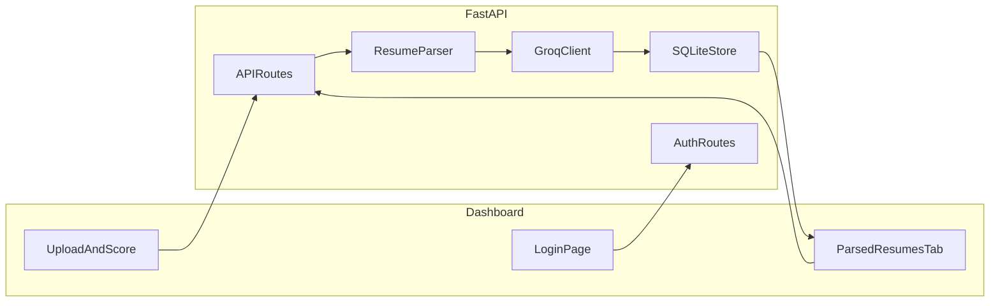

# Smart Resume Screener

Intelligently parse resumes, extract skills, and match candidates against job descriptions using Groq LLM.

## Features

- Login-protected dashboard (SQLite auth)
- Preset job roles with default descriptions (Core Skills, Keywords, Impact Metrics)
- Custom role and custom job description support
- Upload PDF or TXT resumes
- Extract structured data: skills, experience, education
- Compute a 1-10 match score with justification
- Store parsed resumes in SQLite
- Hamburger/side navigation with two views:
  - Upload and Score
  - Parsed Resumes (all stored candidates for active job)
- Expandable justification text in tables and detail view

## Tech Stack

- Python + FastAPI
- SQLite (users, sessions, jobs, candidates)
- Groq API (`llama-3.3-70b-versatile`)
- pdfplumber for PDF text extraction
- Static HTML/CSS/JS dashboard

## Architecture



### Flow

1. User logs in with SQLite-backed session cookie
2. User selects a target role or enters a custom role
3. User chooses default JD or enters a custom JD
4. User uploads one or more resumes
5. Backend extracts text from PDF/TXT
6. Groq extracts structured resume data
7. Groq scores the candidate against the job description
8. Results are saved in SQLite (`rawText`, `parsedJson`, score, justification)
9. Upload tab shows shortlist (score >= 7)
10. Parsed Resumes tab shows all stored parsed resumes for the active job

## Default Login

```text
Email: abc@gmail.com
Password: abc123
```

## Setup

### 1. Clone the repository

```bash
git clone https://github.com/ShreekarN/Unthinkable-Shortlist-Assessment-Batch-2027-Smart-Resume-Screener.git
cd Unthinkable-Shortlist-Assessment-Batch-2027-Smart-Resume-Screener
```

### 2. Create a virtual environment

```bash
python -m venv venv
venv\Scripts\activate
```

### 3. Install dependencies

```bash
pip install -r requirements.txt
```

### 4. Configure environment variables

Copy `.env.example` to `.env` and add your Groq API key:

```env
GROQAPIKEY=your_key_here
GROQMODEL=llama-3.3-70b-versatile
```

### 5. Run the app

```bash
uvicorn app.main:app --reload --port 8001
```

Open `http://127.0.0.1:8001/login`

## API Endpoints

| Method | Path | Purpose |
|--------|------|---------|
| POST | `/api/auth/login` | Login and create session |
| POST | `/api/auth/logout` | Logout |
| GET | `/api/auth/me` | Current user |
| GET | `/api/job-roles` | Preset role dropdown options |
| GET | `/api/job-templates/{roleKey}` | Default JD for role |
| POST | `/api/jobs` | Save job description |
| POST | `/api/resumes` | Upload PDF/txt, parse, score |
| GET | `/api/jobs/{jobId}/shortlist` | Ranked shortlisted candidates |
| GET | `/api/jobs/{jobId}/parsed` | All parsed resumes for job |
| GET | `/api/candidates/{id}` | Full parsed data + justification |

## LLM Prompts

### Extract prompt (system)

```text
You are a resume parsing specialist for technical hiring workflows.
Read the resume text and extract only factual information present in the document.
Return strict JSON with keys: name (string), skills (array of strings),
experience (array of concise role or project strings),
education (array of concise education strings).
Do not invent details. Do not use markdown. Return JSON only.
```

### Extract prompt (user)

```text
Extract structured resume fields from the text below.

Resume text:
<resume content>
```

### Match prompt (system)

```text
You are a technical recruiter evaluating candidate fit for a specific role.
Compare the parsed resume data against the job description and produce a fair,
evidence-based assessment. Score fit from 1 to 10 where 10 is an excellent match.
Return strict JSON with keys: score (number 1-10),
justification (string with 3-5 complete sentences explaining the score),
strengths (array of role-relevant strengths),
gaps (array of missing or weak areas).
Base conclusions only on provided data. Do not use markdown. Return JSON only.
```

### Match prompt (user)

```text
Evaluate candidate fit using the job description and parsed resume below.

Job description:
<job description>

Parsed resume:
<structured resume JSON>
```

## Testing

```bash
pip install -r requirements-dev.txt
pytest -v
```

## Project Structure

```text
smart-resume-screener/
  app/
    main.py
    config.py
    db.py
    auth.py
    jobtemplates.py
    parser.py
    groqclient.py
    routes.py
    models.py
  static/
    index.html
    login.html
    app.js
    login.js
    style.css
  tests/
  requirements.txt
  .env.example
  README.md
```

## Notes

- Shortlist threshold is score >= 7
- Only PDF and TXT files are supported
- Do not commit `.env` or `resumes.db`
