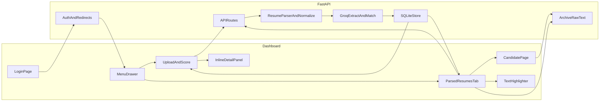

# Smart Resume Screener

Intelligently parse resumes, extract skills, and match candidates against job descriptions using Groq LLM.

## Features

- Login-protected dashboard with SQLite users and session cookies
- Guest users are redirected to login; logged-in users skip the login page
- Preset job roles with default descriptions (Core Skills, Keywords, Impact Metrics)
- Custom role title and custom job description support
- User-defined shortlist threshold per job (1–10, default 7)
- Upload PDF or TXT resumes (multi-file)
- Dual PDF engines (PyMuPDF + pdfplumber) with `normalizeText()` and quality-based selection
- Groq extract step: name, skills, experience, education
- Groq match step: score (1–10), justification, strengths, gaps, evidence phrases
- Highlight extracted resume text by evidence, strengths, gaps, and skills
- Store assessments in SQLite (`rawText`, `parsedJson`, score, justification)
- Menu button opens a side drawer with two views:
  - Upload and Score
  - Parsed Resumes
- Expandable justification text in tables and detail views
- Expandable highlighted parsed text (**Text** action / detail panels)
- Dedicated candidate page (`/candidate`) opens in a new tab
- Archive resume file content while keeping assessment data
- Logout clears the session cookie

## Tech Stack

- Python + FastAPI (`version 1.1.0`)
- SQLite (users, sessions, jobs, candidates)
- Groq API (`llama-3.3-70b-versatile`)
- PyMuPDF + pdfplumber for PDF text extraction
- Static HTML/CSS/JS dashboard (`highlight.js` for resume marking)

## Architecture



### Flow

1. User opens `/` or `/candidate` → redirected to `/login` if no valid session cookie
2. User logs in; session is stored in SQLite and set as an HTTP-only cookie
3. Dashboard UI stays hidden until `/api/auth/me` succeeds (prevents guest flash)
4. User selects a target role or enters a custom role (**Other**)
5. User chooses default JD or enters a custom JD, and sets shortlist threshold (1–10)
6. User creates the job → stored with `minScore`
7. User uploads one or more PDF/TXT resumes
8. Backend extracts and normalizes text (see PDF strategy below)
9. Groq **extract** returns structured resume fields from the normalized text
10. Groq **match** scores fit against the JD using structured data **and** original resume text (up to 8000 chars), returning justification, strengths, gaps, and `evidencePhrases`
11. Results are saved in SQLite (`rawText`, `parsedJson` including match payload, score, justification)
12. Upload tab shows the shortlist for scores at or above that job’s `minScore`
13. Parsed Resumes shows every stored candidate; **Text** opens highlighted extracted content; **Open** opens `/candidate?id=…`
14. Archive clears `rawText` but keeps score and parsed assessment fields

### PDF Parsing Strategy

`app/parser.py` always tries both extractors for PDFs, normalizes each result, then picks the better one:

1. **PyMuPDF** (`fitz`) text extract
2. **pdfplumber** text extract
3. **`normalizeText()`** on both outputs — ligatures, smart quotes/dashes, mojibake, hyphenated line breaks, split emails/URLs, whitespace cleanup
4. **`textQualityScore()`** chooses the winner (length + contact-info bonus; penalty for broken split headers such as `P\nANKAJ`)
5. TXT uploads are decoded as UTF-8 and passed through the same normalizer

### Auth redirects

| Route | Unauthenticated | Authenticated |
|-------|------------------|---------------|
| `/` | redirect → `/login` | dashboard |
| `/candidate` | redirect → `/login` | candidate page |
| `/login` | login form | redirect → `/` |

## Default Login

```text
Email: abc@gmail.com
Password: abc123
```

## Setup

### 1. Clone the repository

```bash
git clone https://github.com/ShreekarN/Unthinkable-Shortlist-Assessment-Batch-2027-Smart-Resume-Screener.git
cd Unthinkable-Shortlist-Assessment-Batch-2027-Smart-Resume-Screener
```

### 2. Create a virtual environment

```bash
python -m venv venv
venv\Scripts\activate
```

### 3. Install dependencies

```bash
pip install -r requirements.txt
```

### 4. Configure environment variables

Copy `.env.example` to `.env` and add your Groq API key:

```env
GROQAPIKEY=your_key_here
GROQMODEL=llama-3.3-70b-versatile
```

### 5. Run the app

```bash
uvicorn app.main:app --reload --port 8001
```

Open `http://127.0.0.1:8001/login`

## API Endpoints

| Method | Path | Purpose |
|--------|------|---------|
| POST | `/api/auth/login` | Login and create session |
| POST | `/api/auth/logout` | Logout |
| GET | `/api/auth/me` | Current user |
| GET | `/api/job-roles` | Preset role dropdown options |
| GET | `/api/job-templates/{roleKey}` | Default JD for role |
| POST | `/api/jobs` | Save job description + minScore |
| POST | `/api/resumes` | Upload PDF/txt, parse, score |
| GET | `/api/jobs/{jobId}/shortlist` | Candidates at or above job threshold |
| GET | `/api/jobs/{jobId}/parsed` | All parsed resumes for job |
| GET | `/api/candidates/{id}` | Full assessment, evidencePhrases, rawText |
| POST | `/api/candidates/{id}/archive` | Clear stored file content, keep assessment |

## LLM Prompts

Prompts live in `app/groqclient.py`. Calls use `temperature=0.2`, retry once if JSON parsing fails, and clamp score to 1–10.

### Extract prompt (system)

```text
You are a resume parsing specialist for technical hiring workflows.
Read the resume text and extract only factual information present in the document.
Return strict JSON with keys: name (string), skills (array of strings),
experience (array of concise role or project strings),
education (array of concise education strings).
Do not invent details. Do not use markdown. Return JSON only.
```

### Extract prompt (user)

```text
Extract structured resume fields from the text below.

Resume text:
<resume content>
```

### Match prompt (system)

```text
You are a technical recruiter evaluating candidate fit for a specific role.
Compare the parsed resume data against the job description and produce a fair,
evidence-based assessment. Score fit from 1 to 10 where 10 is an excellent match.
Return strict JSON with keys: score (number 1-10),
justification (string with 3-5 complete sentences explaining the score),
strengths (array of role-relevant strengths),
gaps (array of missing or weak areas),
evidencePhrases (array of 3-8 short phrases copied from the resume wording
that most directly support the score).
Use exact resume phrasing in evidencePhrases when possible.
Base conclusions only on provided data. Do not use markdown. Return JSON only.
```

### Match prompt (user)

```text
Evaluate candidate fit using the job description, original resume text,
and parsed resume below.

Job description:
<job description>

Original resume text (quote evidencePhrases from this when possible):
<normalized resume text, up to 8000 chars>

Parsed resume:
<structured resume JSON>
```

## Highlighting (UI)

`static/highlight.js` marks phrases in extracted resume text. When ranges overlap, higher priority wins:

| Class | Source | Priority | Meaning |
|-------|--------|----------|---------|
| `hl-evidence` | `evidencePhrases` | 4 | Resume wording supporting the score |
| `hl-strength` | `strengths` | 3 | Role-relevant strengths |
| `hl-gap` | `gaps` | 2 | Missing or weak areas |
| `hl-skill` | `skills` | 1 | Parsed skill keywords |

## Testing

```bash
pip install -r requirements-dev.txt
pytest -v
```

Useful filters:

```bash
pytest -v tests/test_unit_parser.py
pytest -v tests/test_integration_api.py
pytest -v tests/test_acceptance.py
```

## Screenshots

Demo screenshots are in the `screenshots/` folder.

## Demo Video

See `demo/Demo-video-Shreekar-Nyayapathi-Smart-Resume-Screener.mp4` for a walkthrough of the current UI and screening flow.

## Project Structure

```text
smart-resume-screener/
  app/
    main.py          # FastAPI app, auth redirects, static routes
    config.py
    db.py
    auth.py
    jobtemplates.py
    parser.py        # PDF/TXT extract + normalize + quality pick
    groqclient.py    # Extract + match prompts and Groq calls
    routes.py
    models.py
  static/
    index.html
    login.html
    candidate.html
    app.js
    candidate.js
    highlight.js
    login.js
    style.css
  screenshots/
  demo/
  tests/
  requirements.txt
  requirements-dev.txt
  pytest.ini
  .env.example
  README.md
```

## Notes

- Shortlist uses the threshold entered when creating each job (default 7)
- Only PDF and TXT files are supported
- Re-upload resumes after prompt/parser changes to refresh evidence phrases
- Archived candidates keep scores and parsed fields but hide raw text in the UI
- Do not commit `.env` or `resumes.db`
