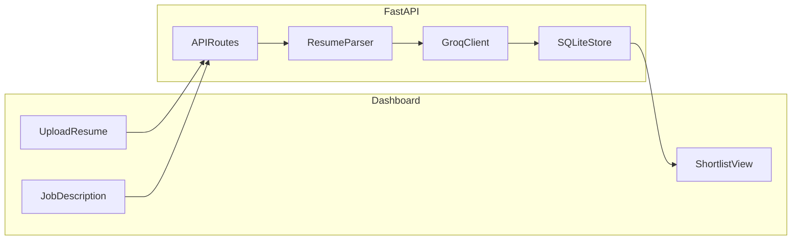

# Smart Resume Screener

Intelligently parse resumes, extract skills, and match candidates against job descriptions using Groq LLM.

## Features

- Upload PDF or TXT resumes
- Extract structured data: skills, experience, education
- Compute a 1-10 match score with justification
- Store parsed resumes in SQLite
- View shortlisted candidates in a simple web dashboard

## Tech Stack

- Python + FastAPI
- SQLite
- Groq API (`llama-3.3-70b-versatile`)
- pdfplumber for PDF text extraction
- Static HTML/CSS/JS dashboard

## Architecture



### Flow

1. User creates a job with title and description
2. User uploads one or more resumes
3. Backend extracts text from PDF/TXT
4. Groq extracts structured resume data
5. Groq scores the candidate against the job description
6. Results are saved in SQLite
7. Dashboard shows shortlisted candidates with score >= 7

## Setup

### 1. Clone the repository

```bash
git clone https://github.com/ShreekarN/Unthinkable-Shortlist-Assessment-Batch-2027-Smart-Resume-Screener.git
cd Unthinkable-Shortlist-Assessment-Batch-2027-Smart-Resume-Screener
```

### 2. Create a virtual environment

```bash
python -m venv venv
venv\Scripts\activate
```

### 3. Install dependencies

```bash
pip install -r requirements.txt
```

### 4. Configure environment variables

Copy `.env.example` to `.env` and add your Groq API key:

```env
GROQAPIKEY=your_key_here
GROQMODEL=llama-3.3-70b-versatile
```

### 5. Run the app

From the project root:

```bash
uvicorn app.main:app --reload
```

Open `http://127.0.0.1:8000` in your browser.

## API Endpoints

### Create job

```bash
curl -X POST http://127.0.0.1:8000/api/jobs \
  -H "Content-Type: application/json" \
  -d "{\"title\":\"Backend Developer\",\"description\":\"Python, FastAPI, SQL, REST APIs\"}"
```

### Upload resume

```bash
curl -X POST http://127.0.0.1:8000/api/resumes \
  -F "jobId=1" \
  -F "file=@resume.pdf"
```

### Get shortlist

```bash
curl http://127.0.0.1:8000/api/jobs/1/shortlist
```

### Get candidate detail

```bash
curl http://127.0.0.1:8000/api/candidates/1
```

## LLM Prompts

### Extract prompt

System:

```text
You extract resume data. Return strict JSON only with keys:
name (string), skills (array of strings), experience (array of strings),
education (array of strings). No markdown.
```

User:

```text
Resume text:
<resume content>
```

### Match prompt

System:

```text
Compare the following resume with this job description and rate fit on
1-10 with justification. Return strict JSON only with keys:
score (number 1-10), justification (string), strengths (array of strings),
gaps (array of strings). No markdown.
```

User:

```text
Job description:
<job description>

Parsed resume:
<structured resume JSON>
```

## Demo Video Checklist

Record a 2-3 minute demo showing:

1. App startup and dashboard
2. Creating a job description
3. Uploading 2-3 resumes
4. Viewing shortlisted candidates
5. Opening candidate detail with score and justification

## Project Structure

```text
smart-resume-screener/
  app/
    main.py
    config.py
    db.py
    parser.py
    groqclient.py
    routes.py
    models.py
  static/
    index.html
    app.js
    style.css
  requirements.txt
  .env.example
  README.md
```

## Notes

- Shortlist threshold is score >= 7
- Only PDF and TXT files are supported
- Do not commit `.env` or `resumes.db`
